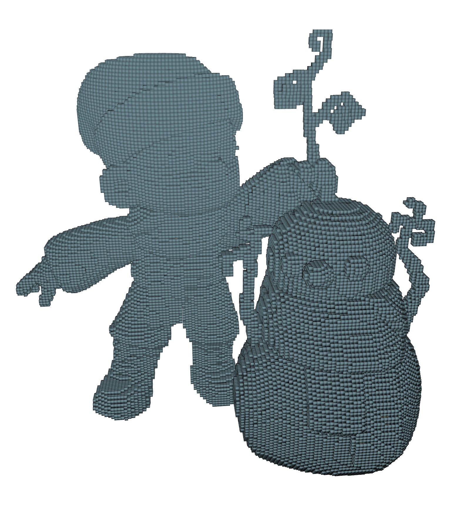
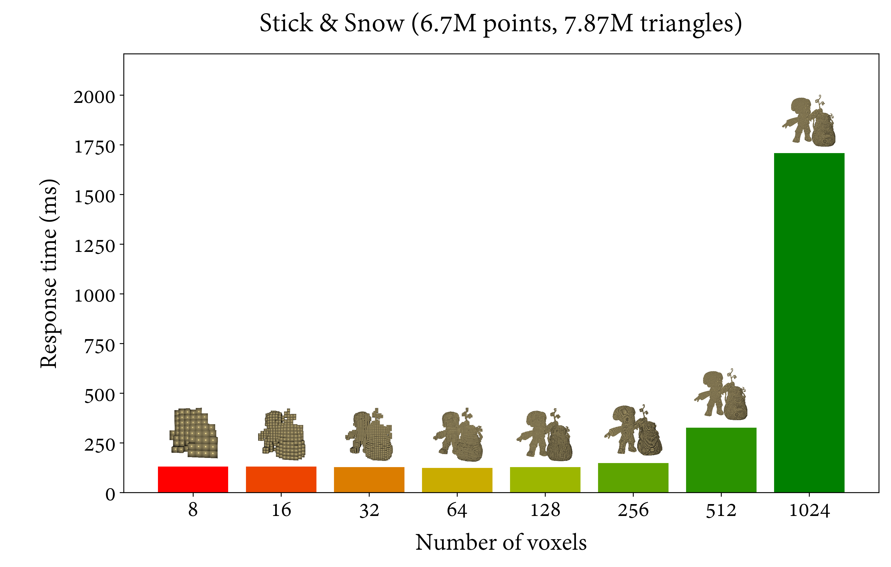

# CUDA Voxelizer

 
 
 
 

Voxelizer implemented in CUDA to generate `.ply` and `.obj` files from voxels filled by the polygons of an input model. The application also provides a naïve shading scenario to visualize the result.

     
    <em>Voxelization of dimensionality 412x256x256 (X x Y x Z) rendered with <a href="https://github.com/knightcrawler25">GLSL-PathTracer</a> project.</em>

## Configuration

The project has been developed with Microsoft Visual Studio 2022, and the following steps were tested over such an environment. The installed CUDA version is 11.8, and its configuration in MVS was established as set by default, except for symbols. To this end, the generation of relocatable device code was enabled. 

`Generate Relocatable Device Code: Yes (-rdc=true)`

`Target Machine Platform: 64-bit (--machine 64)`

`Code Generation: compute_52, sm_52`

## Features

1. The renderer is shared with <a href="https://github.com/AlfonsoLRz/AG2223">AG2323</a> and thus we refer the reader to this project to check which rendering features are included and how are interactions defined (which keys and menus are active).

2. Voxelization of any model that can be read by Assimp. These are loaded as a set of components, with each one iterated to fill a regular grid of variable dimensionality. Triangles from every component are sampled with `n` random points within them to fill occupied voxels.
    - The number of sample points can be configured through `n`. The fewer, the faster and less accurate is the voxelization.

    - The voxelization of every component is overlapped with other components through CUDA streams. The maximum number of streams can also be configured for measuring the response time. 

    - The response time is also measured in `ms`, excluding the transfer of voxel positions to GPU in OpenGL framework.

    - A testing module is given to test different voxelization dimensions over the same model(s).

## Performance

The following section aims to note how efficient is the implemented algorithm over some sample models. The computer specs are the following: AMD Ryzen Threadripper 3970X 32-Core Processor (3.69 GHz), 256 GB RAM and 2x NVIDIA A6000.

### Sticks & Snow

3D model with 6.7M points and 7.87M triangle, by <a href="https://tinynocky.gumroad.com/">tinynocky</a>.

<table style="margin:auto; width:90%">
<tr>
    <td>
        
    </td>
    <td>
        
    </td>
</tr>
</table>

     
    <em>Voxelization of dimensionality 412x256x256 (X x Y x Z) rendered with <a href="https://github.com/knightcrawler25/">GLSL-PathTracer</a> project.</em>

